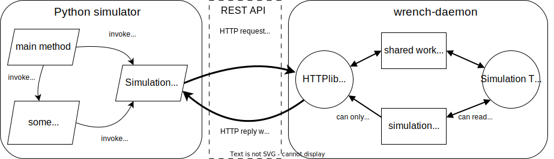

# Guide for Developers

[last updated: 01/20/2024]

This page provides information for developers of this project who wish to augment the Python API (and typically also the REST API) to WRENCH. 

Knowledge of the [WRENCH C++ API](https://wrench-project.org/wrench/latest/api_developer.html) of course helps a lot, but can be acquired piecemeal. When in doubt, ask a WRENCH lead developer. 

## Overall Design

 


A Python simulator is written using the WRENCH Python (left-hand side of the figure above). The Python API provides users with classes for simulation objects (`Task`, `File`, `BareMetalComputeService`, `StandardJob`, etc.), just like the [WRENCH C++ API](https://wrench-project.org/wrench/latest/api_developer.html) does. These objects are very thin and hold almost no state, and in particular no simulation state. All simulation state is held in the running WRENCH daemon (right-hand side of the figure). These thin Python objects provide some methods, and all these methods invoke a method of the `Simulation` class (which has some methods that can also be invoked directory).  This class answers these methods calls by placing REST API calls over HTTP sent to the WRENCH daemon.  These calls consists of a *path* (or route), which includes some static and some dynamic data, and of attached JSON dynamic data. 

The WRENCH daemon, implemented in C++, consists of two threads. The first is the HTTP server thread, which received REST API calls over HTTP. It defines all available routes and the specification of all expected data in the requests and all expected data in the responses. For each route, in invokes a particular method. Each of these methods takes in JSON data and returns JSON data.  The second is the simulation thread. This threads is a WRENCH simulator that is in charge of running the simulation based on incoming REST API requests. **Only this thread can issue simulated operations** (a bit of a difficult concept, ask lead developers :)).  So when the HTTP server thread receives a request to read simulation state, it can answer it directly. But when it receives a request that would modify simulation state, it cannot answer it and instead needs to communicate with the simulation thread.  This communication is via a thread-safe "work queue" data structure. The HTTP server threads puts "please do this" work units in the work queue, and the simulation thread retrieves these work units, does them, and replies to the HTTP server thread that it's been done.  Note that the requests coming over HTTP are all in text. That is, simulation objects are referred to by their names.  The WRENCH C++ API makes it possible to retrieve some simulation objects by their names, but not all.  The WRENCH daemon just has several helper "registry" data structures to keep track of some simulation objects by their names. 

## Steps to add a new REST API call

In the `wrench` repository:

  - Edit `wrench/tools/wrench/wrench-daemon/doc/wrench-openapi.json` to add the new path and all its specification. This file uses the [OpenAPI/Swagger standard](https://swagger.io/specification/)
  - In the above, make sure that the new path has its `operationId` field set to the name the C++ method that will be called when a request to this path is placed
  - Implement the above method in `wrench/tools/wrench/wrench-daemon/src/SimulationController.cpp`

## Steps to augment a new Python API 

In the `wrench-python-api` repository:

  - Add whatever class/method, with full docstrings, where most of the "work" is done by calling a method of the `Simulation` class
  - In `wrench-python-api/wrench/api/simulation.py`, implement the needed method(s)

---

## Example #1: Supporting the creation/use of a Workflow object (no interaction with simulation thread)

The simplest way to learn how to do this is to go through a complete example. Let's look at how part of the "workflow" concept is implemented in the API. A workflow is a data structure that contains "tasks". The [WRENCH C++ API](https://wrench-project.org/wrench/latest/api_developer.html) provides a `Workflow` class, with all kinds of features and methods, and some of these are implemented as well in the Python API.  Let's look at the creation of a workflow.

In the C++ API, a workflow is created by calling the static method `createWorkflow()` of the
`Workflow` class. In the REST API, we thus need some path that can be
requested to cause the creation of a workflow. You will note in
`wrench/tools/wrench/wrench-daemon/doc/wrench-openapi.json` that all path
have about the same prefix: `/simulation/{simid}/...`. Each running simulation
has an ID, and all paths begin by specifying this ID. In that file, there is a path specified as:

```json
"/simulation/{simid}/createWorkflow": {
      "post": {
        "tags": [ 
          "WRENCH"
        ],  
        "summary": "Create a blank workflow.",
        "operationId": "createWorkflow",
        "parameters": [
          {
            "name": "simid",
            "in": "path",
            "description": "ID of the simulation",
            "required": true,
            "schema": { 
              "type": "string"
            } 
          } 
        ],
        "responses": { 
          "200": {
            "description": "OK",
            "content": {
              "application/json": {
                "schema": {
                  "$ref": "#/components/schemas/WorkflowResponse"
                } 
              }     
            }       
          },      
          "405": {
            "description": "Invalid input",
            "content": {}
          }
        }
      }
    }
```

A few things to note:

  - The path specifies "post", "put", or "get" ("post" in this case), and typically something that modifies simulation state will be "post" or "put". 
  - The `operationId` is set to `createWorkflow`, meaning that on the server side (in `/wrench/tools/wrench/wrench-daemon/src/SimulationController.cpp`) there is a C++ method called `createWorkflow()` that will answer requests for this path.
  - The `parameters` field described the data provided in the path, in this case just the `simid`. In other paths, you will note that most paths in addition specify a `requestBody` that lists all the data that's supposed to be passed as JSON data as part of the request sent to the path.
  - The `response` field specifies what the client should expect in return. Note that the `schema` is provided as a reference to a specification. This is to avoid code duplication. All referenced specifications are listed at the end of the file. 


Looking into  `wrench/tools/wrench/wrench-daemon/src/SimulationController.cpp`, we find the following
C++ method:

```cpp
  /**
   * REST API Handler
   * @param data JSON input
   * @return JSON output
   */
1 json SimulationController::createWorkflow(json data) {
2
3    auto wf = wrench::Workflow::createWorkflow();

4    json answer;
5    answer["workflow_name"] = wf->getName();

6    this->workflow_registry.insert(wf->getName(), wf);

7    return answer;
8  }
```

This method, like all others like it, takes in a json and returns a json. In this case, we don't need any input to just create a (blank) workflow.  At line 1, the C++ API call for creating a workflow is invoked, creating
a `Workflow` object. We want to return the workflow's name to the client (since we can't send me a C++ reference/pointer/address!), and this answer is in JSON. This is created at lines 4 and 5. The C++ WRENCH API does not make it possible to retrieve a workflow based on its name (because in C++, we can just use the reference to the object). So instead, in the `wrench-daemon` we create a convenient data structure called `workflow_registry`, which is really a map where the keys are strings and the values are `Workflow` instances. This data structure is updated at line 6. And finally, we return the answer at line 7. This way, next time we get a REST API call about a workflow, whose name is provided by the client, we will be able to retrieve the `Workflow` instance. 


In the Python API, we have opted to add a `create_workflow()` method to the `Simulation` class. The implementation of this method is as:

```python
def create_workflow(self) -> Workflow:
    """
    Create a workflow

    :return: A workflow object
    :rtype: Workflow
    """

1    r = self.__send_request_to_daemon(
         requests.post,
         f"{self.daemon_url}/{self.simid}/createWorkflow", 
         json_data={})

2    response = r.json()

3    if not response["wrench_api_request_success"]:
4        self.terminated = True
5        raise WRENCHException(response["failure_cause"])

6    return Workflow(self, response["workflow_name"])
```

At line 1, the REST API request is sent to the `wrench-daemon` (using a
utility "private" method called `__send_request_to_daemon()`. Note that method type ("post")
and the path matches that specified in the JSON above (otherwise we'll get an error). Note
also that the `json_data` field is left blank, since no additional data is needed by the
`SimulationController::createWorkflow()` method on the server side.  At line 2, the response
is received. At lines 3-5 is the error checking. Each response is augmented automatically
on the server side with `"wrench_api_request_success"` and `"failure_cause"` fields, which
can be checked, as above, on the client side. If all is well, then at line 6, we create
a Workflow object, which is just a class with a name. This is a convenience class for the user,
which provides several methods. 

Let's look at one of the methods for the `Workflow` class, `add_task()`:

```python
def add_task(self, name: str, flops: float, min_num_cores: int, max_num_cores: int, memory: float) -> Task:
    """
    Add a task to the workflow

    :param name: task name
    :type name: str
    :param flops: number of flops
    :type flops: float
    :param min_num_cores: minimum number of cores
    :type min_num_cores: int
    :param max_num_cores: maximum number of cores
    :type max_num_cores: int
    :param memory: memory requirement in bytes
    :type memory: float

    :return: A task object
    :rtype: Task

    :raises WRENCHException: if there is any error in the response
    """
    return self.simulation._workflow_create_task(self, name, flops, min_num_cores, max_num_cores, memory)
```

This method's signature matches the corresponding method in the C++ API and takes several parameters. The important thing here is that this method merely places a call to a "protected" method of the `Simulation` class. By design, for simplicity, only the `Simulation` class places REST API calls. Let's look at this method in that class:

```python
def _workflow_create_task(self, workflow: Workflow, name: str, flops: float, 
                          min_num_cores: int, max_num_cores: int, memory: float) -> Task:
    """
    Add a task to the workflow
    :param workflow: the workflow
    :type workflow: Workflow
    :param name: task name
    :type name: str
    :param flops: number of flops
    :type flops: float
    :param min_num_cores: minimum number of cores
    :type min_num_cores: int
    :param max_num_cores: maximum number of cores
    :type max_num_cores: int
    :param memory: memory requirement in bytes
    :type memory: float

    :return: A task object
    :rtype: Task
             
    :raises WRENCHException: if there is any error in the response
    """
1   data = {"workflow_name": workflow.get_name(),
            "name": name,
            "flops": flops,
            "min_num_cores": min_num_cores,
            "max_num_cores": max_num_cores,
            "memory": memory}

2   r = self.__send_request_to_daemon(requests.put, f"{self.daemon_url}/{self.simid}/"
                                                    f"{workflow.name}/createTask", json_data=data)

3   response = r.json()

4   if response["wrench_api_request_success"]:
5       workflow.tasks[name] = Task(self, workflow, name)
6       return workflow.tasks[name]

7   raise WRENCHException(response["failure_cause"])
```

At line 1, the JSON data to be passed along the request is created. The request is then placed
with a path and that data at line 2 (note that this is a PUT request). The response if obtained at line 3. If no error
is detected, then a new `Task` object instance is created (whose class is defined in `wrench-python-api/wrench/task.py`), inserted into the `Workflow` object's map of tasks (line 5), and returned.  Otherwise, an exception is raised (line 7). 

Let's now look at the specification of the REST API path in `wrench/tools/wrench/wrench-daemon/doc/wrench-openapi.json`:

```json
"/simulation/{simid}/{workflow_name}/createTask": {
  "put": {
    "tags": [
      "WRENCH"
    ],
    "summary": "Create a new task.",
    "operationId": "createTask",
    "parameters": [
      {
        "name": "simid",
        "in": "path",
        "description": "ID of the simulation",
        "required": true,
        "schema": {
          "type": "string"
        }       
      },        
      {       
        "name": "workflow_name",
        "in": "path",
        "Description": "Name of the workflow",
        "required": true,
        "schema": {
          "type": "string"
        }       
      }       
    ],        
    "requestBody": {
      "description": "Task characteristics.",
      "content": {
        "application/json": {
          "schema": {
            "$ref": "#/components/schemas/Task"
          }
        }
      },
      "required": true
    },
    "responses": {
      "200": {
        "description": "OK",
        "content": {
          "application/json": {
            "schema": {
              "$ref": "#/components/schemas/GenericResponse"
            }
          }
        }
      },
      "405": {
        "description": "Invalid input",
        "content": {}
      }
    }
  }
```

This is similar to the JSON above, but:

  - There is more information in the path, where we now have a `workflow_name` field
  - There is associated JSON data, specified in the `requestBody` field. 

To avoid clutter and code duplication (although in this case, it's likely that no other requests
will have the same JSON data specification), the schema for the request body, which is called
`components/schemas/Task`, is specified at the end of the file. It looks like:

```json
"Task": {
  "type": "object",
  "properties": {
    "workflow_name": {
      "type": "string",
      "description": "Name of the workflow to which the task is being added"
    },
    "name": {
      "type": "string",
      "description": "Task's name"
    },
    "flops": {
      "type": "number",
      "format": "number",
      "description": "The task's floating operations per second"
    },
    "min_num_cores": {
      "type": "number",
      "format": "unsigned long",
      "description": "The task's minimum number of cores"
    },
    "max_num_cores": {
      "type": "number",
      "format": "unsigned long",
      "description": "The task's maximum number of cores"
    },
    "memory": {
      "type": "number",
      "format": "number",
      "description": "The task's memory requirement"
    }
  }
}
```

You will note that the Python code above does construct JSON data in accordance to the path specification. This specification indicates that the name of the server method to handle requests to this path is `createTask`. Let's look at this method in `wrench/tools/wrench/wrench-daemon/src/SimulationController.cpp`:

```cpp
/** 
 * @brief REST API Handler
 * @param data JSON input
 * @return JSON output
 */
json SimulationController::createTask(json data) {

1   std::string workflow_name = data["workflow_name"];

2   std::shared_ptr<Workflow> workflow;
3   if (not this->workflow_registry.lookup(workflow_name, workflow)) {
4       throw std::runtime_error("Unknown workflow  " + workflow_name);
    }

6   auto t = workflow->addTask(data["name"],
                               data["flops"],
                               data["min_num_cores"],
                               data["max_num_cores"],
                               data["memory"]);
7   return {};
}   
```

At line 1, the workflow name is extracted from the JSON data passed by the client (which was found in the path). The workflow registry it looked up to see if the workflow exists (line 3). If not, an exception is thrown, which will cause a JSON answer to be sent back with field `wrench_api_request_success` set to False and a `failure_cause` field set to a helpful string message.  If the workflow does exist, then a task is added to it at line 6, using the C++ API. Nothing needs to be sent back to the client, hence line 7. 


## Example #2: Interaction with the simulation thread

In the previous example, there was no interaction with the simulation thread because creating a workflow and adding tasks to a workflow have no impact on the simulation's execution. That is, nothing impacts the timeline of the simulated execution managed by the simulation thread. This is not a very easy concept to understand, and it's not very clearly documented in the C++ API. Ask lead developers when in doubt. If in the HTTP server thread you place a call that you shouldn't place, because it would impact the simulated execution's timeline, you'll just get a weird segfault. That means that you should have have instead "asked" the simulation thread to do it for you. 

Without going into the full details with the Python and REST API side, let's look at a method in `wrench/tools/wrench/wrench-daemon/src/SimulationController.cpp` that does ask the simulation thread to do something. For instance: 

```cpp
/** 
 * REST API Handler
 * @param data JSON input
 * @return JSON output
 */     
json SimulationController::lookupFileAtStorageService(json data) {
1    std::string ss_name = data["storage_service_name"];
2    std::string filename = data["filename"];
3           
4    std::shared_ptr<StorageService> ss; 
5    if (not this->storage_service_registry.lookup(ss_name, ss)) {
6      throw std::runtime_error("Unknown storage service " + ss_name);
7    }
8    
9    std::shared_ptr<DataFile> file;
10   try {
11     file = Simulation::getFileByID(filename);
12   } catch (std::invalid_argument &e) {
13     throw std::runtime_error("Unknown file " + filename);
14   }   
15        
16   BlockingQueue<std::tuple<bool, bool, std::string>> file_looked_up;
17        
18   // Push the request into the blocking queue
19   this->things_to_do.push([file, ss, &file_looked_up]() {
20     try {
21       bool result = ss->lookupFile(file);
22       file_looked_up.push(std::tuple(true, result, ""));
23     } catch (std::invalid_argument &e) {
24       file_looked_up.push(std::tuple(false, false, e.what()));
25     }
26   });
27  
28   // Poll from the shared queue
29   std::tuple<bool, bool, std::string> reply;
30   file_looked_up.waitAndPop(reply);
31   bool success = std::get<0>(reply);
32   if (not success) {
33     std::string error_msg = std::get<2>(reply);
34     throw std::runtime_error("Cannot lookup file:" + error_msg);
35   } else {
36     json answer;
37     answer["result"] = std::get<1>(reply);
38     return answer;
39   }
40 }
```

The above is to answer a request to lookup a (simulated) file at a
(simulated) storage service (something that the WRENCH C++ API supports).
The JSON data received includes the name of the file and the name of the
storage service (lines 1-2). This method first looks up the storage service
registry to make sure there is a storage service with that name (lines
4-7). Then is checks whether there is a file by that name as well (lines
9-14). This is supported by the WRENCH C++ API, and so no helper registry
data structure is needed. 

Once these checks have been performed, the serious business begins:

  - At line 16, the method creates a thread-safe data structure, a blocking queue, in which threads can put/get (bool, bool, string) tuples.
  
  - At line 19, the method puts into a similar data structure, which is known both to the HTTP server thread and to the simulation thread. This is the "work queue" data structure mentioned at the top of this document. So that this data structure is fully general, it contains lambdas! (i.e., anonymous functions). That way, to tell the simulation thread to do something, one just gives it the code it should run!  This code is written at lines 20-25. At line 21 is how, using the C++ API, one does a file lookup at a storage service. Based on the result, a (bool, bool, string) tuple is put into the blocking queue created at line 16. In case of a success (i.e., the lookup didn't fail), the tuple is set to `(true, result, "")`, where `result` is true or false (depending on whether the file was found at the storage service or not). If case of a failure (i.e., the lookup failed), the tuple is set to `(false, false, e.what())`, where `e.what()` is an exception's error message. 

  - At lines 29-30, the method waits for the reply (i.e., the tuple) from the simulation thread. It then extracts the first element of the tuple to see whether the lookup succeeded (line 31). Based on success or failure, the appropriate response is sent back to the client (lines 32-39).  And voila!

Of course, to fully understand the above example, you should look at the path specification in `wrench/tools/wrench/wrench-daemon/doc/wrench-openapi.json`, the `_lookup_file_at_storage_service()` method in `wrench-python-api/wrench/simulation.py` (which places the REST API request), and the `lookup_file()` method in `wrench-python-api/wrench/storage_service.py`.  


